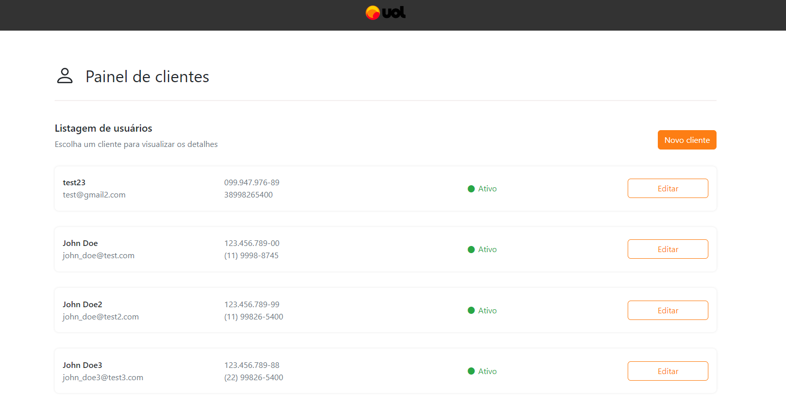
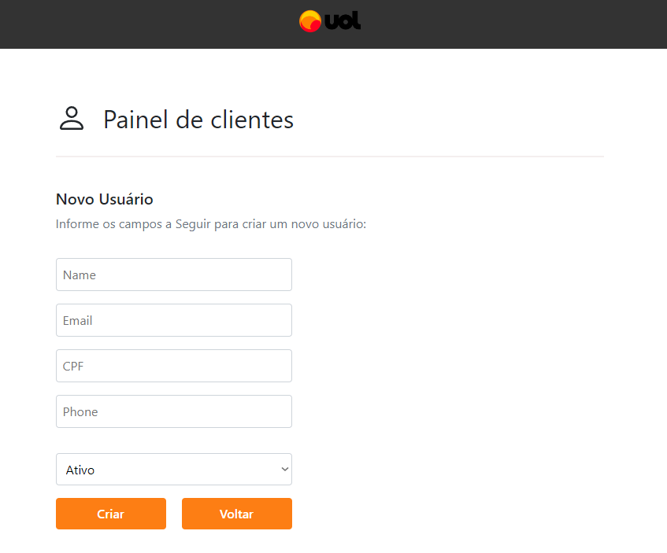
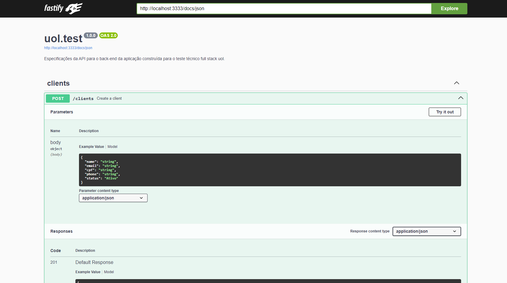

# CRUD de Clientes - UOL

## Front End e API em Node.js

<p align="center">

</p>

<p align="center">
  <a href="#sobre">Sobre</a> •
  <a href="#funcionalidades">Funcionalidades</a> •
  <a href="#como-executar">Como executar</a>
</p>




---

## Sobre

<p align="center">

</p>

Este projeto foi desenvolvido para criar um CRUD de clientes para a UOL, incluindo funcionalidades de criação, leitura, atualização e exclusão de clientes, que possuem campos como nome, e-mail, número de telefone, CPF e status. O projeto conta com um front end desenvolvido em React com TypeScript e uma API backend construída com Node.js, utilizando tecnologias como Fastify, Prisma, e SQLite para gerenciamento de dados.

O front end foi desenvolvido usando **React**, **Vite** para otimização, **TypeScript** para tipagem, **React Bootstrap** para estilização, **styled-components** para customização visual, e **Context API** para gerenciamento de estado.

O back end foi desenvolvido com **Node.js** usando **Fastify** como framework, **Prisma** para ORM, **Zod** para validação de dados, **SQLite** para banco de dados local, e **Swagger** para documentação da API. **Faker.js** foi utilizado para gerar dados fictícios.

---

## Arquitetura

### Front End

No diretório `/src` do front end, temos as seguintes pastas:

- `/assets`: Contém imagens e logos do projeto.
- `/components`: Contém os componentes da aplicação, incluindo:
  - `ClientCard`: Exibe informações de cada cliente, e possui o botão "Editar Cliente".
  - `ClientList`: Lista todos os cards de clientes e exibe o botão "Criar Cliente".
  - `EditOrAddClient`: Formulário para criar ou editar clientes.
  - `Header`: Cabeçalho da aplicação.
- `/Context`: Para gerenciamento de estado, incluindo:
  - `ClientProvider`: Provedor de contexto para o estado de clientes.
  - `Context.ts`: Contém o hook `useAppContext()` para acesso ao contexto.
- `/interfaces`: Define a interface `Client`, usada para tipagem dos dados do cliente.
- `/utils`: Contém utilitários, como funções para validação e máscaras de CPF e número de telefone.

### Back End

No diretório `/src` do back end, temos:

- `/interfaces`: Define a mesma interface `Client` usada no front end.
- `/lib`: Configurações para Prisma, incluindo logging.
- `/routes`: Contém as rotas de API para a aplicação.
- `errorHandler.ts`: Manipula erros na API.
- `server.ts`: Configura o servidor, definindo as rotas e integrando Fastify e outros módulos.

---

## Funcionalidades

<p align="center">




</p>

- **CRUD de Clientes**: Cadastro, edição, exclusão e listagem de clientes.
- **Validação de Formulário**: O formulário de criação e edição valida o nome, CPF, telefone e e-mail do cliente. Mensagens de erro são exibidas caso os dados estejam incorretos.
- **Responsividade**: A aplicação se ajusta para diferentes tamanhos de tela, com cada cartão de cliente sendo exibido em layout responsivo.
- **Documentação da API com Swagger**: A API possui documentação acessível via Swagger UI, incluindo exemplos de uso para cada rota.

---

## Como executar

Para rodar o projeto localmente, você precisará do **Node.js** e **npm** instalados.

### Configuração do Projeto

1. Clone o repositório e entre na pasta do projeto:

    ```bash
    # Clone o repositório
    $ git clone https://github.com/Vitor-Tx/uol-test.git

    # Entre na pasta do projeto
    $ cd uol-test
    ```

2. Instale as dependências do projeto para o front end e o back end:

    ```bash
    # Na raiz do projeto, instale as dependências do front end
    $ cd view
    $ npm install

    # Instale as dependências do back end
    $ cd ../api
    $ npm install
    ```

3. Na pasta raíz do backend(/api), crie um arquivo .env com esse conteúdo:

    ```
    DATABASE_URL="file:./dev.db"
    ```

4. Na pasta da api, configure o banco de dados SQLite usando Prisma:

    ```bash
    $ npm run db:migrate
    ```

5. Popule o banco de dados(se desejar):

    ```bash
    $ npm run db:seed
    ```

6. Inicie o servidor de desenvolvimento para o front end e o back end:

    ```bash
    # Em um terminal, na pasta raíz do front end, rode:
    $ npm run dev

    # Abra outro terminal, na pasta raíz do back end, e rode:
    $ npm run dev

    # Caso queira monitorar o banco de dados, abra outro terminal, na pasta raíz do back end, e rode:
    $ npx prisma studio
    ```

7. Acesse o projeto:

    - Front end: `http://localhost:5173/`
    - Back end: `http://localhost:3333`

8. A documentação da API pode ser acessada em `http://localhost:3333/docs`.

---

## Tecnologias Utilizadas

### Front End
- **React**
- **TypeScript**
- **Vite**
- **React Bootstrap**
- **Styled-components**
- **Context API**

### Back End
- **Node.js**
- **Fastify**
- **Prisma**
- **Zod**
- **Swagger**
- **SQLite**

---

## Sobre o Desenvolvedor

**Vitor Manoel Gonçalves Teixeira**
Desenvolvedor Full Stack com experiência sólida em React, Next.js, Angular, JQuery, Bootstrap, Python, Django, PHP, Laravel, JavaScript, TypeScript, Node.js, Dart, Flutter, React Native, entre outras tecnologias.

- **Whatsapp**: (38) 99826-5400
- **Email**: vitor.teixeira267@gmail.com
- **Github**: [Vitor-Tx](https://github.com/Vitor-Tx)
- **LinkedIn**: [Vitor Teixeira](https://www.linkedin.com/in/vitor-teixeira-eof/)

---
